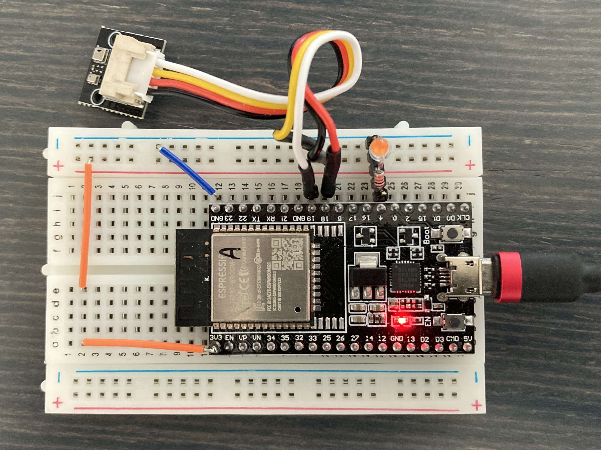

# Complete Azure MQTT sample using BMP280 barometric pressure sensor with Azure IoT SDK Library

This example demonstrates how to use the Azure IoT SDK library and BMP280 pressure sensor.
> Note: this example is configured for ESP32 but can be easily reconfigured for any nanoFramework-supported board with WiFi and I2C bus

## Prerequisites
* Visual Studio with nanoFramework extension
* nanoFramework-supported board with WiFi and I2C bus

## Board preparation
* `dotnet tool install -g nanoff`
* `nanoff --platform esp32 --serialport COM7 --update`

## Source Code
https://github.com/tdjastrzebski/ESP32_AZURE

## References
* [nanoframework website](https://www.nanoframework.net)
* [nanoframework GitHub](https://github.com/nanoframework)
* [getting started](https://docs.nanoframework.net/content/getting-started-guides/getting-started-managed.html)
* [nanoFramework Network helpers](https://github.com/nanoframework/System.Device.Wifi)
* [nanoFramework Azure IoT SDK](https://github.com/nanoframework/nanoFramework.Azure.Devices)
* [Azure IoT documentation for MQTT](https://docs.microsoft.com/en-us/azure/iot-hub/iot-hub-mqtt-support)
* [nanoFramework.IoT.Device Bmxx80 devices](https://github.com/nanoframework/nanoFramework.IoT.Device/tree/develop/devices/Bmxx80)

